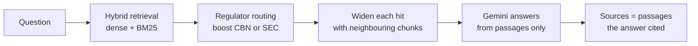

# Nigerian Banking Regulation Assistant

A question-answering assistant over Nigerian banking and capital-market regulation. Ask a compliance question in plain English and it answers **only** from 24 indexed documents published by the CBN, SEC, NDIC and the Federal Government, citing the passages it used. When the documents don't cover a question, it says so rather than guessing.

It's built as retrieval-augmented generation (RAG): find the relevant passages first, then have a language model answer from those passages alone.

> Answers are a research aid, not legal or compliance advice. Every answer links to its source documents; verify figures and paragraph references there before relying on them.

## How it answers a question



**Retrieval** runs two searches and fuses them by reciprocal rank: a dense search over `bge-small-en-v1.5` embeddings in Chroma, and a BM25 keyword search whose tokenizer keeps circular references like `FPR/DIR/PUB/CIR/002/009` intact. Each chunk is indexed with its regulator, reference number and title prepended, so those are searchable too.

**Regulator routing** nudges ranking toward the regulator a question is about — a question about banks toward CBN, NDIC and federal statutes; one about securities or digital assets toward the SEC. It boosts rather than filters, so a misread question costs a document rank, never recall.

**Neighbour expansion** sends each retrieved chunk to the model with the chunks either side of it, because chunk boundaries in scanned statutes often fall mid-sentence and strand a rule from the clause that qualifies it.

**Generation** numbers every passage in the prompt and instructs the model to answer only from them, cite by number, refuse with a fixed sentence when the passages don't contain the answer, and flag answers that rely on OCR'd scans.

**Sources** shown are the passages the answer actually cited, not simply the top-ranked ones — so every `[n]` in an answer resolves to a passage you can read in the app.

## Setup

Requires Python 3.11 and a free [Gemini API key](https://aistudio.google.com/apikey). Commands are for Windows PowerShell.

```powershell
python -m venv .venv
.\.venv\Scripts\Activate.ps1
python -m pip install -r requirements.txt
```

Create a `.env` file in the project root:

```
GEMINI_API_KEY=your-key-here
```

Build the vector index. It isn't committed, so this is needed once after cloning; it embeds all 3,828 chunks and takes a few minutes on CPU:

```powershell
python scripts/build_index.py
```

Run the app:

```powershell
python -m streamlit run app.py
```

It opens at `http://localhost:8501` and listens on your machine only. Use `python -m streamlit` rather than the bare `streamlit` command — the launcher script often isn't on `PATH` on Windows.

Re-running ingestion from the raw PDFs (notebooks 01–02) additionally needs [Tesseract OCR](https://github.com/UB-Mannheim/tesseract/wiki). Just running the app does not.

## The corpus

| Regulator | Documents | Chunks |
| --- | ---: | ---: |
| SEC — Securities and Exchange Commission | 6 | 2,336 |
| CBN — Central Bank of Nigeria | 15 | 1,173 |
| NDIC — Nigeria Deposit Insurance Corporation | 2 | 237 |
| FGN — federal statute (Money Laundering Act 2022) | 1 | 82 |
| **Total** | **24** | **3,828** |

Seven documents are scanned and were read by OCR; answers relying on them carry a transcription caveat. `data/sources.csv` records where every document came from.

## Project layout

```
app.py                     Streamlit interface
src/retrieval.py           dense, BM25 and hybrid search; regulator routing
src/rag.py                 prompt, context assembly, caching, cited sources, model fallback
src/quality.py             extraction-quality check for the corpus
scripts/build_index.py     build the Chroma index from data/chunks.jsonl
scripts/reindex_document.py  re-embed one corrected document in place
notebooks/                 00 setup check · 01 scrape · 02 ingest · 03 RAG and evaluation
data/chunks.jsonl          the chunked corpus with metadata
data/sources.csv           provenance manifest for every document
data/test_questions.json   the evaluation set
data/phase6_results.csv    graded evaluation results
data/answer_cache.json     cached answers, so the evaluation re-runs without API calls
```

## Evaluation

17 test questions: 16 with a known answer and one deliberate out-of-scope question (Kenyan capital rules) that the system should refuse. Each answer was graded against the passages it cited, not against outside knowledge. Details and notes for every question are in `data/phase6_results.csv`.

| Result | Count |
| --- | ---: |
| Correct | 11 |
| Partial | 5 |
| Wrong | 1 |

The one wrong answer turned out not to be a retrieval failure. The SEC complaints framework had a text layer encoded with a non-standard font, so it extracted as a letter-for-letter cipher — the word "complaint" appeared nowhere in its sixteen chunks — and the system correctly refused to answer from unreadable text. The document was re-OCR'd, moving it from rank 621 to rank 1 for that question, and it now answers correctly. `src/quality.py` was added so this class of problem is caught at ingestion rather than by a failed answer.

Of the five partial answers, two are gaps in the corpus rather than faults in the system: no ingested document defines when an account becomes dormant, and none states a numeric liquidity ratio.

## Known limitations

- **Follow-up questions aren't understood.** Each question is answered on its own, so "what about merchant banks?" needs the full question. The app says so in its sidebar.
- **One document is still degraded.** The CBN tiered-KYC circular is a poor scan — it reads "Valid Nigerian Voters Card" as "Walid Migeran Veters Card" — and clean SEC text can outrank it on account-opening questions.
- **The corpus leans toward the SEC,** which holds 61% of all chunks. Regulator routing counteracts this, but its effect was measured only on the keyword half of retrieval, not on the full hybrid system.
- **Keyword search alone already ranks the right document first or near-first for 14 of the 16 scored questions.** That suggests the dense half may be adding noise; it's the obvious next thing to investigate.
- **Free-tier limits.** Gemini's free tier allows about 20 requests a day for the primary model. The app falls back to `gemini-3.5-flash-lite` when the primary model is busy or out of quota, and shows which model answered.
- **The answer cache is keyed on model and question, not on the prompt,** so cached answers predate any later change to the prompt wording. Delete `data/answer_cache.json` to regenerate them.

## Checking corpus quality

```python
import pandas as pd
from src.quality import readability_report

chunks = pd.read_json("data/chunks.jsonl", lines=True)
print(readability_report(chunks))
```

Documents are scored by the share of words that are common English. Healthy regulatory prose scores 0.20–0.46; anything below 0.05 is flagged unreadable and anything below 0.18 degraded.
